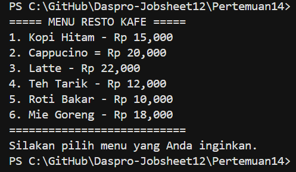
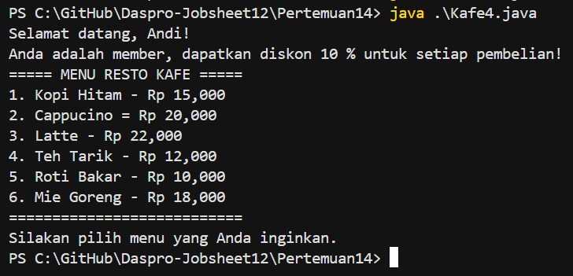
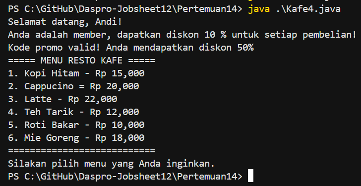
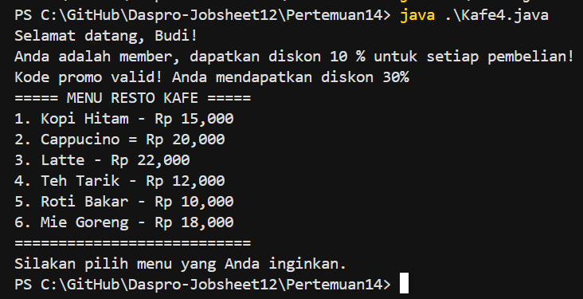
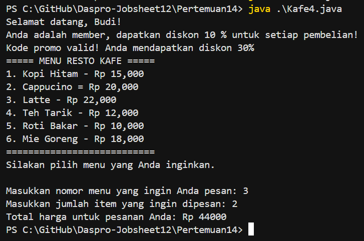
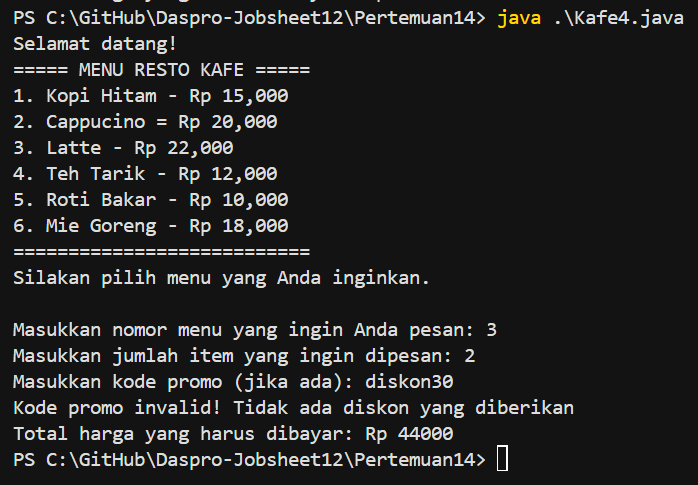
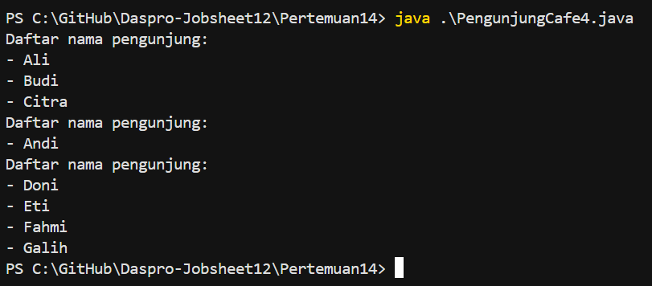

# JOBSHEET 12

# PERCOBAAN 

## - Percobaan 1 : Membuat Fungsi Tanpa Parameter 

## - Percobaan 1 : Verifikasi Hasil Percobaan 



_Pertanyaan:_

1.  Apakah fungsi tanpa parameter selalu harus bertipe void?
2.  Apakah daftar menu pada program kafe dapat ditampilkan tanpa menggunakan fungsi Menu() ? Modifikasi kode program tersebut untuk dapat menampilkan daftar menu tanpa menggunakan fungsi!
3.  Jelaskan keuntungan menggunakan fungsi Menu() dibandingkan menulis semua perintah penampilan menu langsung di dalam fungsi main.
4.  Uraikan secara singkat alur eksekusi program ketika fungsi Menu() dipanggil dari main (mulai dari program dijalankan sampai daftar menu tampil di layar).

_Jawaban:_

1.  Tidak, fungsi tanpa parameter tidak harus selalu bertipe void. Fungsi tanpa parameter berarti fungsi tersebut tidak menerima input dari luar. Jadi, Fungsi tanpa parameter boleh void atau boleh mengembalikan nilai. Parameternya tidak ada tapi return type bebas.
2.  Tentunya bisa
    Code : 
    ```java 
        package Pertemuan14;
        public class Kafe4 {
    
            public static void main(String[] args) {
                System.out.println("===== MENU RESTO KAFE =====");
                System.out.println("1. Kopi Hitam - Rp 15,000");
                System.out.println("2. Cappucino = Rp 20,000");
                System.out.println("3. Latte - Rp 22,000");
                System.out.println("4. Teh Tarik - Rp 12,000");
                System.out.println("5. Roti Bakar - Rp 10,000");
                System.out.println("6. Mie Goreng - Rp 18,000");
                System.out.println("===========================");
                System.out.println("Silakan pilih menu yang Anda inginkan.");
            }
        }
    ```
    Output : 

    

3.  Keuntungan menggunakan fungsi :
    - Kode lebih rapi dan terstruktur : Fungsi membuat program lebih mudah dibaca dan dikelola      karena tugas tertentu dipisah ke dalam blok kode sendiri.
    - Reusability (dapat digunakan kembali) : Fungsi dapat dipanggil berkali-kali tanpa menulis ulang kode.
    - Mempermudah untuk melakukan perbaikan : Perubahan cukup dilakukan pada satu fungsi tanpa merusak bagian lain.
    - Menghindari kode duplikasi : Dengan fungsi, kita tidak perlu copy-paste blok kode yang sama.
4.  Alur eksekusi program ketika fungsi Menu() dipanggil dari main : 
    1.  Program dijalankan, dan eksekusi selalu dimulai dari fungsi 
    ```java
        public static void main(String[] args) 
    ```
    2.  Di dalam main(), program menemukan perintah: Menu();
    3.  Ketika baris tersebut dieksekusi, aliran program berpindah dari main() ke fungsi:
    ```java 
        public static void Menu()
    ```
    4.  Program menjalankan semua perintah System.out.println() yang ada di dalam fungsi Menu(), satu per satu mulai dari atas sampai bawah.
    5.  Setiap baris println akan menampilkan teks menu ke layar.
    6.  Setelah seluruh isi fungsi Menu() selesai dieksekusi, program kembali lagi ke baris berikutnya di dalam fungsi main().
    7.  Karena tidak ada perintah lain setelah Menu(), program kemudian berakhir.

## - Percobaan 2 : Membuat Fungsi Dengan Parameter 

## - Percobaan 2 : Verifikasi Hasil Percobaan 



_Pertanyaan:_

1.  Apakah kegunaan parameter di dalam fungsi?
2.  Jelaskan mengapa pada percobaan ini fungsi Menu() menggunakan parameter namaPelanggan dan isMember?
3.  Apakah parameter sama dengan variabel? Jelaskan.
4.  Jelaskan bagaimana cara kerja parameter isMember pada fungsi Menu(). Apa perbedaan output ketika isMember bernilai true dan ketika false?
5.  Apa yang akan terjadi jika memanggil fungsi Menu() tanpa menyertakan parameter namaPelanggan dan isMember?
6.  Modifikasi kode di atas dengan menambahkan parameter baru kodePromo (String). Jika kodePromo adalah "DISKON50", tampilkan berikan diskon 50%. Jika kodePromo adalah "DISKON30", tampilkan berikan diskon 30%. Jika tidak ada kode promo yang berlaku, tampilkan kode invalid.
7.  Berdasarkan fungsi Menu() di atas, jika nama pelanggan adalah "Budi", pelanggan tersebut member, dan menggunakan kode promo "DISKON30", tuliskan satu baris perintah pemanggilan fungsi menu yang benar.
8.  Menurut Anda, apakah penggunaan parameter namaPelanggan dan isMember pada fungsi Menu() membuat program lebih mudah dibaca dan dikembangkan dibandingkan jika nilai-nilai tersebut ditulis langsung di dalam fungsi tanpa parameter? Jelaskan alasan Anda.

_Jawaban:_

1.  Parameter digunakan untuk mengirim data ke dalam fungsi agar fungsi bisa bekerja lebih dinamis, fleksibel, dan dapat digunakan ulang tanpa perlu mengubah kode di dalamnya.
2.  Penjelasan fungsi Menu() menggunakan parameter:
    - namaPelanggan : agar fungsi bisa menampilkan nama pelanggan yang berbeda.
    - isMember : agar fungsi bisa menentukan apakah pelanggan mendapat diskon member.
    
    Dengan parameter, fungsi menjadi lebih fleksibel, dinamis, dan dapat digunakan untuk banyak pelanggan berbeda, tidak hanya "Andi".
3.  Tidak, parameter bukan hal yang sama dengan variabel tapi keduanya saling berkaitan. Parameter adalah variabel yang dideklarasikan di dalam tanda kurung pada definisi sebuah fungsi/metode, dan digunakan untuk menerima nilai dari luar (dari pemanggil fungsi). Variabel adalah tempat menyimpan data yang nilainya dapat berubah selama program berjalan. Parameter adalah variabel khusus yang digunakan untuk menerima input ke dalam fungsi.
4.  isMember adalah parameter bertipe boolean (hanya bsia bernilai true atau false) yang digunakan untuk menentukan : Apakah pelanggan adalah member atau bukan. Jika member akan mendapatkan diskon. Jika bukan member tidak mendapatkan diskon.

    - Cara kerja parameter isMember : 
    1.  Saat isMember == true 
        - Kondisi if (isMember) menjadi benar (true)
        - Maka perintah di dalamnya dijalankan 
        - Output menampilkan pesan diskon member 
    2.  Saat isMember == false 
        - Kondisi if (isMember) menjadi salah (false)
        - Maka perintah di dalam if tidak dijalankan
        - Output tidak ada pesan diskon 
5.  Program akan error (tidak bisa dikompilasi). Karena fungsi Menu() didefinisikan seperti ini : 
    ```java 
        public static void Menu(String namaPelanggan, boolean isMember)
    ```
    Artinya, fungsi tersebut wajib menerima 2 parameter String namaPelanggan dan boolean isMember. Kedua parameter harus dikirim ketika fungsi dipanggil. Jika tidak, Java tidak tahu nilai apa yang harus dimasukkan ke variabel tersebut. Jadi, memanggil fungsi tanpa parameter akan menyebabkan compile-time error, karena fungsi tersebut membutuhkan input untuk bekerja.
6.  Code : 
    ```java 
        package Pertemuan14;
        public class Kafe4 {

            public static void Menu(String namaPelanggan, boolean isMember, String kodePromo){
                System.out.println("Selamat datang, " + namaPelanggan + "!");

                if (isMember) {
                    System.out.println("Anda adalah member, dapatkan diskon 10 % untuk setiap pembelian!");
                }
                if (kodePromo == "DISKON50") {
                    System.out.println("Kode promo valid! Anda mendapatkan diskon 50%");
                } else if (kodePromo == "DISKON30") {
                    System.out.println("Kode promo valid! Anda mendapatkan diskon 30%");
                } else {
                    System.out.println("Kode promo invalid");
                }
                System.out.println("===== MENU RESTO KAFE =====");
                System.out.println("1. Kopi Hitam - Rp 15,000");
                System.out.println("2. Cappucino = Rp 20,000");
                System.out.println("3. Latte - Rp 22,000");
                System.out.println("4. Teh Tarik - Rp 12,000");
                System.out.println("5. Roti Bakar - Rp 10,000");
                System.out.println("6. Mie Goreng - Rp 18,000");
                System.out.println("===========================");
                System.out.println("Silakan pilih menu yang Anda inginkan.");
            }
            public static void main(String[] args) {
                Menu("Andi", true, "DISKON50");
            }
        }
    ```
    Output : 


7.  Perintah pemanggilan fungsi menu yang benar.
    Code : 
    ```java 
            public static void main(String[] args) {
                Menu("Budi", true, "DISKON30");
        }
    ```

    Output : 


8.  Ya, penggunaan parameter namaPelanggan dan isMember membuat program jauh lebih mudah dibaca, fleksibel, dan dikembangkan dibandingkan jika nilainya ditulis langsung di dalam fungsi. Fungsi bisa dipakai untuk nama dan status member yang berbeda - beda. Menggunakan parameter lebih baik karena bisa digunakan berkali-kali untuk data berbeda.

## - Percobaan 3 : Membuat Fungsi Dengan Nilai Kembalian 

## - Percobaan 3 : Verifikasi Hasil Percobaan 



_Pertanyaan:_

1.  Jelaskan secara singkat kapan suatu fungsi membutuhkan nilai kembalian (return value) dan kapan fungsi tidak perlu mengembalikan nilai. Berikan minimal satu contoh dari program kafe pada Percobaan 3 untuk masing-masing kasus.
2.  Fungsi hitungTotalHargaNoAbsen saat ini mengembalikan total harga berdasarkan pilihanMenu dan jumlahPesanan. Sebutkan tipe data nilai kembalian dan dua buah parameter yang digunakan fungsi tersebut. Jelaskan arti masing-masing parameter dalam konteks program kafe.
3.  Modifikasi kode di atas sehingga fungsi hitungTotalHargaNoAbsen dapat menerima kodePromo. Jika kodePromo adalah "DISKON50", maka mendapat diskon 50% dari totalHarga dan tampilkan diskon. Jika kodePromo adalah "DISKON30", maka mendapat diskon 30% dari totalHarga dan tampilkan diskon. Jika tidak ada kode promo yang berlaku, tampilkan kode invalid dan tidak ada pengurangan total harga totalHarga.
4.  Modifikasi kode di atas sehingga bisa memilih beberapa jenis menu berbeda serta menampilkan total keseluruhan pesanan. Bagaimana memodifikasi program sehingga pengguna dapat: memesan lebih dari satu jenis menu (misalnya menu 1 dan 3 sekaligus), dan menampilkan total keseluruhan pesanan (gabungan dari semua jenis menu)?

_Jawaban:_

1.  a.  Fungsi yang membutuhkan nilai kembalian (return value) ketika fungsi harus menghasilkan jawaban atau hasil perhitungan, dan hasil tersebut ingin dipakai lagi oleh bagian program lain.
    - Contoh dari program kafe pada Percobaan 3 : 
    ```java 
            public static int hitungTotalHarga(int pilihanMenu, int banyakItem) {
            int[] hargaItems = {15000, 20000, 22000, 12000, 10000, 18000};

            int hargaTotal = hargaItems[pilihanMenu - 1] * banyakItem;
            return hargaTotal;
        }
    ```
    - Penjelasan : 
        - Fungsi ini menghitung total harga pesanan.
        - Hasil perhitungannya dibutuhkan di main() untuk ditampilkan kepada user.
        - Karena program butuh hasilnya, maka harus ada return int (return hargaTotal).

    b.  Fungsi yang tidak membutuhkan nilai kembalian (void) ketika fungsi hanya melakukan tugas tertentu seperti mencetak menu, menampilkan pesan, atau melakukan proses tanpa perlu mengirim hasil kembali ke pemanggil.
    - Contoh dari program kafe Percobaan 3 :
    ```java 
            public static void Menu(String namaPelanggan, boolean isMember, String kodePromo){
                System.out.println("Selamat datang, " + namaPelanggan + "!");

                if (isMember) {
                    System.out.println("Anda adalah member, dapatkan diskon 10 % untuk setiap pembelian!");
                }
                if (kodePromo.equals("DISKON50")) {
                    System.out.println("Kode promo valid! Anda mendapatkan diskon 50%");
                } else if (kodePromo.equals("DISKON30")) {
                    System.out.println("Kode promo valid! Anda mendapatkan diskon 30%");
                } else {
                    System.out.println("Kode promo invalid");
                }
                System.out.println("===== MENU RESTO KAFE =====");
                System.out.println("1. Kopi Hitam - Rp 15,000");
                System.out.println("2. Cappucino = Rp 20,000");
                System.out.println("3. Latte - Rp 22,000");
                System.out.println("4. Teh Tarik - Rp 12,000");
                System.out.println("5. Roti Bakar - Rp 10,000");
                System.out.println("6. Mie Goreng - Rp 18,000");
                System.out.println("===========================");
                System.out.println("Silakan pilih menu yang Anda inginkan.");
            }
    ```
    - Penjelasan :
        - Fungsi ini hanya menampilkan menu dan informasi promosi.
        - Tidak ada nilai yang perlu dikembalikan ke main().
        - Karena hanya melakukan output ke layar, maka cukup menggunakan void.
2.  - Tipe Data Nilai Kembalian (Return Type)
        - Fungsi hitungTotalHarga memiliki tipe data int. Karena fungsi ini akan mengembalikan total harga dari pesanan dalam bentuk angka (bilangan bulat). 
        ```java
            public static int hitungTotalHarga(int pilihanMenu, int banyakItem)
        ``` 
    - Dua parameter dalam fungsi 
        - Fungsi ini memiliki 2 parameter : 
            a. int pilihanMenu 
            - Paremeter ini menunjukkan nomor menu yang dipilih pelanggan.
            - Nilainya berkisar antara 1-6, sesuai daftar menu :
            1. Kopi Hitam
            2. Cappucino
            3. Latte 
            4. Teh Tarik 
            5. Roti Bakar
            6. Mie Goreng
            - Arti dalam konteks program : Program menggunakan angka ini untuk mengambil harga item dari array hargaItems berdaskan indeks.

            b. int banyakItem 
            - Parameter ini mewakili jumlah porsi/item yang dipesan pelanggan.
            - Contoh : jika pelanggan ingin membeli 3 Cappucino, maka banyakItem = 3.
            - Arti dalam konteks program : Nilai ini digunakan untuk menghitung total harga dengan rumus :
            ```java 
                int hargaTotal = hargaItems[pilihanMenu - 1] * banyakItem
            ``` 
3.  Code : 
    ```java 
        package Pertemuan14;

        import java.util.Scanner;

        public class Kafe4 {

            public static void Menu(){
                System.out.println("Selamat datang!");

                System.out.println("===== MENU RESTO KAFE =====");
                System.out.println("1. Kopi Hitam - Rp 15,000");
                System.out.println("2. Cappucino = Rp 20,000");
                System.out.println("3. Latte - Rp 22,000");
                System.out.println("4. Teh Tarik - Rp 12,000");
                System.out.println("5. Roti Bakar - Rp 10,000");
                System.out.println("6. Mie Goreng - Rp 18,000");
                System.out.println("===========================");
                System.out.println("Silakan pilih menu yang Anda inginkan.");
            }
            public static int hitungTotalHarga(int pilihanMenu, int banyakItem, String kodePromo) {
                int[] hargaItems = {15000, 20000, 22000, 12000, 10000, 18000};

                int hargaTotal = hargaItems[pilihanMenu - 1] * banyakItem;

                // Variabel untuk diskon 
                double diskon = 0;

                // Mengecek kode promo 
                if (kodePromo.equals("DISKON50")) {
                    diskon = 0.50;
                    System.out.println("Kode promo valid! Anda mendapatkan diskon 50%");
                } else if (kodePromo.equals("DISKON30")) {
                        diskon = 0.30;
                        System.out.println("Kode promo valid! Anda mendapatkan dikskon 30%");
                } else {
                    System.out.println("Kode promo invalid! Tidak ada diskon yang diberikan");
                }
                
                // Hitung total harga setelah diskon
                int totalSetelahDiskon = (int)(hargaTotal - (hargaTotal * diskon));

                return totalSetelahDiskon;
            }
            public static void main(String[] args) {
                Scanner sc = new Scanner(System.in);
                Menu();

                System.out.print("\nMasukkan nomor menu yang ingin Anda pesan: ");
                int pilihanMenu = sc.nextInt();

                System.out.print("Masukkan jumlah item yang ingin dipesan: ");
                int banyakItem = sc.nextInt();

                System.out.print("Masukkan kode promo (jika ada): ");
                String kodePromo = sc.next();

                int totalHarga = hitungTotalHarga(pilihanMenu, banyakItem, kodePromo);

                System.out.println("Total harga yang harus dibayar: Rp " + totalHarga);
            }
        }
    ``` 
    Output : 


4.  Code :
    ```java 
        package Pertemuan14;

        import java.util.Scanner;

        public class Kafe4 {

            public static void Menu(){
                System.out.println("Selamat datang!");

                System.out.println("===== MENU RESTO KAFE =====");
                System.out.println("1. Kopi Hitam - Rp 15,000");
                System.out.println("2. Cappucino = Rp 20,000");
                System.out.println("3. Latte - Rp 22,000");
                System.out.println("4. Teh Tarik - Rp 12,000");
                System.out.println("5. Roti Bakar - Rp 10,000");
                System.out.println("6. Mie Goreng - Rp 18,000");
                System.out.println("===========================");
                System.out.println("Silakan pilih menu yang Anda inginkan.");
            }
            public static int hitungTotalHarga(int pilihanMenu, int banyakItem) {
                int[] hargaItems = {15000, 20000, 22000, 12000, 10000, 18000};
                return hargaItems[pilihanMenu - 1] * banyakItem;

            }
            public static int terapkanPromo(int totalHarga, String kodePromo) {
                // Variabel untuk diskon 
                double diskon = 0;
                
                // Mengecek kode promo 
                if (kodePromo.equals("DISKON50")) {
                    diskon = 0.50;
                    System.out.println("Kode promo valid! Anda mendapatkan diskon 50%");
                } else if (kodePromo.equals("DISKON30")) {
                    diskon = 0.30;
                    System.out.println("Kode promo valid! Anda mendapatkan dikskon 30%");
                } else {
                    System.out.println("Kode promo invalid! Tidak ada diskon");
                }
                return (int)(totalHarga - (totalHarga * diskon));
            }
                public static void main(String[] args) {
                Scanner sc = new Scanner(System.in);
                Menu();

                int totalSemuaPesanan = 0;
                char tambahPesanan;

                do {
                    System.out.print("\nMasukkan nomor menu yang ingin Anda pesan: ");
                    int pilihanMenu = sc.nextInt();

                    System.out.print("Masukkan jumlah item: ");
                    int banyakItem = sc.nextInt();

                    int totalHarga = hitungTotalHarga(pilihanMenu, banyakItem);
                    totalSemuaPesanan += totalHarga;

                    System.out.print("Apakah ingin menambah pesanan lain? (y/n): ");
                    tambahPesanan = sc.next().charAt(0);    
                } while (tambahPesanan == 'y' || tambahPesanan == 'Y');

                System.out.print("\nMasukkan kode promo (jika ada): ");
                String kodePromo = sc.next();

                int totalAkhir = terapkanPromo(totalSemuaPesanan, kodePromo);

                System.out.println("\n-----------------------------------");
                System.out.println("Total keseluruhan pesanan: Rp " + totalSemuaPesanan);
                System.out.println("Total setelah promo: Rp " + totalAkhir);
                System.out.println("-----------------------------------");
            }
        }
    ```
    Output : 


## - Percobaan 4 : Fungsi Varargs 

## - Percobaan 4 : Verifikasi Hasil Percobaan 



_Pertanyaan:_

1.  Jelaskan mengapa penulisan parameter di praktikum 4 ditulis dengan String... namaPengunjung!
2.  Modifikasi method daftarPengunjung menggunakan for-each loop.
3.  Bisakah menggunakan dua tipe data varaargs dalam satu fungsi? Jelaskan jawaban Anda berdasarkan aturan varargs di Java, dan berikan contohnya!
4.  Jelaskan apa yang terjadi jika fungsi daftarPengunjung dipanggil tanpa argumen. Apakah program akan error saat kompilasi, error saat dijalankan, atau tetap berjalan? Jika tetap berjalan, bagaimana output yang dihasilkan?

_Jawaban:_

1.  String... namaPengunjung digunakan karena : 
    - Agar metode dapat menerima jumlah parameter yang berbeda - beda (fleksibel).
    - Lebih praktis dibanding membuat banyak overload.
    - Secara internal Java mengubah varArgs menjadi array, sehingga bisa diproses dengan loop.


     
    


